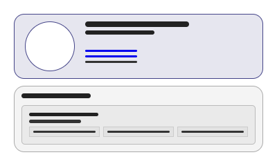
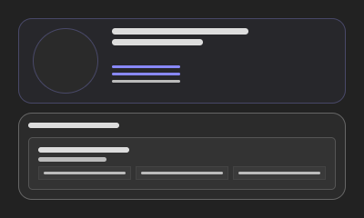

# Curriculum Vitae

Responsive Curriculum Vitae built with HTML & CSS, available in both light & dark themes.

## Documents

- [light cv](documents/cv-light.pdf)
- [dark cv](documents/cv-dark.pdf)

## Preview





## Features

- ATS-friendly PDF
- Text-selectable PDF
- Print-ready A4 format
- Updatable blueprint
- Light & Dark themes
- Responsive layout
- Hosted on GitHub
- Version controlled with Git

## Technologies

- HTML5
- CSS3

## Project Structure

```text
.
├── assets
│   ├── fonts
│   └── img
│       ├── mockups
│       └── profile
├── documents
├── styles
├── index.html
└── README.md
```

## Author

**Emanuel Villadiego Araújo**

- [LinkedIn](https://www.linkedin.com/in/emanuelva/)
- [GitHub](https://github.com/emanuel-va)

## License

MIT